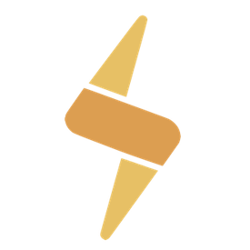

[![Contributors][contributors-shield]][contributors-url]
[![Issues][issues-shield]][issues-url]
[![MIT License][license-shield]][license-url]
[![LinkedIn][linkedin-shield]][linkedin-url]


<!-- PROJECT LOGO -->
<br />
<p align="center">
  <a href="https://www.choixe.app">
    
  </a>
  <h2 align="center">choiXe</h2>

  <p align="center">
    Maximize profits by making data-driven decisions!
    <br />
    <a href="https://www.choixe.app">View Live</a>
    ·
    <a href="https://github.com/choiXe/website/issues">Report Bug</a>
    ·
    <a href="https://github.com/choiXe/website/issues">Request Feature</a>
  </p>
</p>
<br />

<!-- TABLE OF CONTENTS -->
<details open="open">
  <summary>Table of Contents</summary>
  <ol>
    <li>
      <a href="#about-the-project">About The Project</a>
      <ul>
        <li><a href="#built-with">Built With</a></li>
      </ul>
    </li>
    <li>
      <a href="#getting-started">Getting Started</a>
      <ul>
        <li><a href="#prerequisites">Prerequisites</a></li>
        <li><a href="#installation">Installation</a></li>
      </ul>
    </li>
    <li><a href="#function">Function</a></li>
    <li><a href="#roadmap">Roadmap</a></li>
    <li><a href="#contributing">Contributing</a></li>
    <li><a href="#license">License</a></li>
    <li><a href="#contact">Contact</a></li>
  </ol>
</details>


<!-- ABOUT THE PROJECT -->
## About The Project

[![Product Name Screen Shot][product-screenshot]](https://example.com)

Hello, we are a startup creating a open-source platform that provides investment information for newbie stock investors.

To prevent the problems listed above and to help stock investors, we thought of a way to effectively communicate investment information necessary for stock investment, and in August 2021, we launched a platform called **choiXe**.

We provide detailed analysis about the company by analyzing analyst reports along with other data rather than focusing heavily on technical indicators and derive upside potential and investment attractiveness.

The choiXe team is constantly striving to improve and develop the platform, and has set goals to focus on providing accurate information and user-friendly UI/UX.  

The team name **choiXe** comes from the combination of choice + X (variable).  
It means that you're the one who makes decisions about what stocks to invest in, not others.

### Built With

- Frontend
    * [React](https://reactjs.org)
    * [Sass](https://sass-lang.com)
- Backend
    * [AWS AppSync](https://aws.amazon.com/appsync/)
    * [GraphQL](https://graphql.org)
    * [AWS Lambda](https://aws.amazon.com/lambda/)
    * [AWS DynamoDB](https://aws.amazon.com/dynamodb/)
- CI/CD
    * [AWS Amplify](https://aws.amazon.com/amplify/)

<!-- GETTING STARTED -->
## Getting Started

### Prerequisites
* [Node.js](https://nodejs.org/en/download/)
* [npm](https://www.npmjs.com/)
```zsh
> npm install npm@latest -g
```

### Installation
1. Clone this repo 
```shell
> git clone https://github.com/choiXe/website.git choiXe
```
2. `cd` into the repo and install all dependencies
```shell
> cd choiXe
> npm install
```
3. Start your own local server and go checkout the [website!](http://localhost:3000)
```shell
> npm start
```

<!-- USAGE EXAMPLES -->
## Function
<details>
  <summary><b>Navigation Bar</b></summary>
  <ul>
    <li>Logo / Company Name</li>
    <li>
      Quick Navigation Menu
      <ul>
        <li>About</li>
        <li>Sector</li>
        <li>Stock</li>
      </ul>
    </li>
  </ul>
</details>
<details>
  <summary><b>Home Page</b></summary>
  <ul>
    <li>
      Sector Menu
      <ul>
        <li>List of sectors to choose from</li>
      </ul>
    </li>
    <li>
      Market Index
      <ul>
        <li>Korea & Global market indices</li>
      </ul>
    </li>
    <li>
      Favorites
      <ul>
        <li>A user's favorite stocks list for easy access</li>
      </ul>
    </li>
    <li>
      Latest Reports
      <ul>
        <li>List of the most recent analysts' reports</li>
      </ul>
    </li>
  </ul>
</details>
<details>
  <summary><b>Sector Page</b></summary>
  <ul>
    <li>Sector Menu</li>
    <li>
      Sector Detail
      <ul>
        <li>Treemap, Expected Yield, Top 3 Yields of subsectors</li>
      </ul>
    </li>
    <li>
      Stock List
      <ul>
        <li>
          List of stocks under the current big sector and their data overview
        </li>
      </ul>
    </li>
  </ul>
</details>
<details>
  <summary><b>Stock Page</b></summary>
  <ul>
    <li>
      Stock Detail
      <ul>
        <li>Expected Yield, Candle Chart, Investment Score</li>
      </ul>
    </li>
    <li>Investment Stats</li>
    <li>
      Keywords Wordcloud
      <ul>
        <li>Keywords frequently mentioned with the stock</li>
      </ul>
    </li>
    <li>Investor Trend</li>
    <li>
      Misc.
      <ul>
        <li>Report: Analysts' reports about the stock</li>
        <li>News: News list that mentions the stock</li>
        <li>Financials: Profitability & Growth Graph</li>
        <li>Profile: A short company info</li>
      </ul>
    </li>
  </ul>
</details>
<details>
  <summary><b>About Page</b></summary>
  <ul>
    <li>A brief Introduction of the platform & our team</li>
  </ul>
</details>

<!-- ROADMAP -->
## Roadmap

See the [open issues](https://github.com/choiXe/website/issues) for a list of proposed features (and known issues).

<!-- CONTRIBUTING -->
## Contributing

Contributions are what make the open source community such an amazing place to be learn, inspire, and create. Any contributions you make are **greatly appreciated**.

1. Fork the Project
2. Create your Feature Branch (`git checkout -b feature/AmazingFeature`)
3. Commit your Changes (`git commit -m 'Add some AmazingFeature'`)
4. Push to the Branch (`git push origin feature/AmazingFeature`)
5. Open a Pull Request

<!-- LICENSE -->
## License

This repository has been created as a part of the ongoing development of the [choiXe](https://github.com/choiXe/website) project.

The work in this repository is licensed under the [MIT](https://github.com/choiXe/choiXe/blob/main/LICENSE) license.

Copyright (c) 2021 choiXe team

<!-- CONTACT -->
## Contact

[Huey Kim](https://www.linkedin.com/in/hueyk/)  
[Sehoan Choi](https://www.linkedin.com/in/sehoanchoi)  
[Ricky Kim](https://www.linkedin.com/in/ricky-kim-/)  
[Yejun Kim](https://www.linkedin.com/in/ye-jun-kim-350033180/)  

Project Link: [https://github.com/choiXe/website](https://github.com/choiXe/website)
> Also interested in backend implementation? visit [here](https://github.com/choiXe/backend)

[contributors-shield]: https://img.shields.io/github/contributors/othneildrew/Best-README-Template.svg?style=for-the-badge
[contributors-url]: https://github.com/choiXe/website/graphs/contributors
[issues-shield]: https://img.shields.io/github/issues/othneildrew/Best-README-Template.svg?style=for-the-badge
[issues-url]: https://github.com/choiXe/website/issues
[license-shield]: https://img.shields.io/github/license/othneildrew/Best-README-Template.svg?style=for-the-badge
[license-url]: https://github.com/choiXe/choiXe/blob/main/LICENSE
[linkedin-shield]: https://img.shields.io/badge/-LinkedIn-black.svg?style=for-the-badge&logo=linkedin&colorB=555
[linkedin-url]: https://www.linkedin.com/company/choixe/about/
[product-screenshot]: public/screenshots/stock.png
